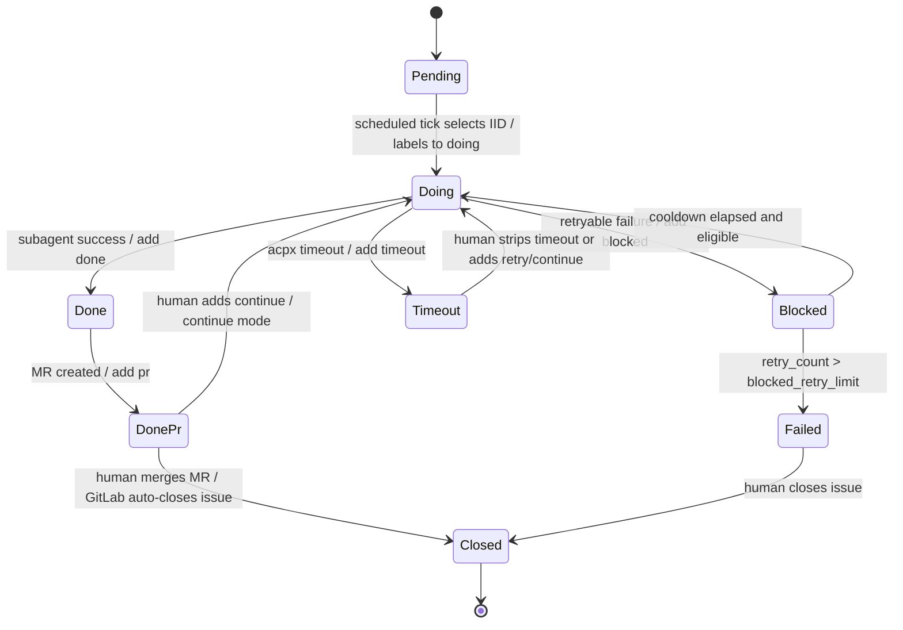

# acpx_auto_tester_ifp 使用文档

本文档面向调度器配置、运维和项目使用者。它说明如何把 trigger prompt 传给
`acpx_auto_tester_ifp`，以及 agent 从收到 trigger 到创建 MR、处理回调的完整流程。

详细实现契约位于
`workspace-acpx_auto_tester/skills/gitlab_issue_campaign_dispatcher/`。本文只描述人需要
知道和配置的内容。

## 1. Agent 是什么

`acpx_auto_tester_ifp` 是一个非交互式 GitLab issue 自动化 agent，用来周期性扫描一批
GitLab issue，并为每个符合条件的 issue 启动一个独立执行单元：

- 主 orchestrator session：固定会话，接收 scheduler tick 和 child completion callback。
- per-issue subagent：每个 issue IID 每次 attempt 启动一个匿名子会话，负责运行
  `acpx claude exec`、提交代码、推分支、上传 Wiki 证据、创建 MR，并返回一行 compact
  JSON。
- dispatcher shell wrappers：负责所有确定性动作，包括 trigger 解析、flock、状态持久化、
  GitLab reconcile、标签切换、prompt 渲染和 callback bookkeeping。

orchestrator 只做两类 runtime 工具动作：

- 对每个待执行 IID 调用 `sessions_spawn(...)`。
- 当 wrapper 要求清理子会话时，尽力调用 `subagents kill --target <child_session_key>`。

## 2. Trigger Prompt 怎么传

trigger 是普通多行文本，不是 JSON，也不需要代码块。第一行是命令名，后续每行一个
`key=value`。

调度器必须把 trigger 发送到同一个 orchestrator session，通常是：

```text
agent:acpx_auto_tester_ifp:main
```

传递规则：

- 保留换行。
- 不要在值两侧加引号。
- 空行和 `#` 开头的注释行会被忽略。
- 每次 scheduled tick 都要传完整的必填字段。
- 如果使用了非默认 `repo_path`，scheduled trigger 和 callback trigger 都必须继续传同一个值。
- `gitlab_token` 每次都会用于刷新 GitLab CLI 认证，token 可以轮换。

agent 支持两个 trigger command：

| Command | 谁发送 | 用途 |
| --- | --- | --- |
| `RUN_SCHEDULED_ISSUE_CAMPAIGN` | scheduler 周期性发送 | 扫描 issue、形成 batch、spawn per-issue subagent |
| `RUN_CHILD_COMPLETION_CALLBACK` | OpenClaw runtime 在子会话结束后发送 | 把 subagent 的 compact JSON 交回 orchestrator，完成 Phase 6 bookkeeping |

## 3. Scheduled Tick Trigger

### 最小推荐模板

```text
RUN_SCHEDULED_ISSUE_CAMPAIGN
group=<gitlab_group_slug>
project=<gitlab_project_slug>
branch=master
dev_branch=dev
gitlab_token=<token>
issue_min_iid=1
issue_max_iid=100
hourly_issue_quota=5
max_runtime_minutes=55
blocked_retry_limit=3
blocked_cooldown_ticks=1
non_interactive=true
session_mode=per_issue
scheduling_mode=quota_carryover
blocked_policy=skip_and_retry
```

### 带常用可选项的示例

```text
RUN_SCHEDULED_ISSUE_CAMPAIGN
group=claw_gitlab
project=px_ifp_hulat_test
branch=master
dev_branch=dev
gitlab_token=glpat-xxxxxxxx
issue_min_iid=300
issue_max_iid=380
hourly_issue_quota=4
max_runtime_minutes=55
blocked_retry_limit=3
blocked_cooldown_ticks=1
non_interactive=true
session_mode=per_issue
scheduling_mode=quota_carryover
blocked_policy=skip_and_retry
repo_path=/data/ifp1
max_concurrent_subagents=2
max_accounts_per_issue=14
ui_accounts_relpath=ifp-data/ifp-common/ifp_users.json
issue_iids=301,304,310,318
require_labels=acpx-auto,priority::high
require_labels_match=or
acpx_timeout_seconds=18000
run_timeout_seconds=18120
stuck_after_minutes=332
kill_subagent_on_terminal=true
result_basename=ifp-result
data_basename=ifp-data
```

### 必填字段

| 字段 | 含义 |
| --- | --- |
| `group` | GitLab group slug。 |
| `project` | GitLab project slug。 |
| `branch` | 集成/目标分支，MR 会开到这个分支，通常是 `master`。 |
| `dev_branch` | fresh attempt 的干净基线分支，通常是 `dev`；每次运行前也会从最新 `origin/${dev_branch}` 刷新 `.claude/`、`hulat/`、`${DATA_BASENAME}/` 这些共享配置路径。没有独立基线时可设成和 `branch` 一样。 |
| `gitlab_token` | 用于 `glab auth login` 的 token。GitLab host 不从 trigger 推导，而是部署时固定在 `config/gitlab.env`。 |
| `issue_min_iid` | issue IID 范围下限，包含。 |
| `issue_max_iid` | issue IID 范围上限，包含。 |
| `hourly_issue_quota` | 当前 scheduled tick 最多 launch 多少个 IID，不是完成数。 |
| `max_runtime_minutes` | scheduled tick 的 pre-launch wrapper 时间预算；callback 不受这个预算限制。 |
| `blocked_retry_limit` | `blocked` outcome 最多消耗多少次 retry budget，超过后会被提升为 `failed`。 |
| `blocked_cooldown_ticks` | blocked IID 再次可重试前需要等待多少个 scheduled tick。 |

### 固定值字段

下面四个字段必须原样传入：

```text
non_interactive=true
session_mode=per_issue
scheduling_mode=quota_carryover
blocked_policy=skip_and_retry
```

缺失或值不匹配时，本 tick 会直接失败并输出简短 `chat_summary`。

### 常用可选字段

| 字段 | 默认值 | 说明 |
| --- | --- | --- |
| `repo_path` | `/data` | clone parent。最终 repo 路径是 `${repo_path}/${project}`。非默认部署必须在每次 scheduled trigger 和 callback 中都传。 |
| `max_concurrent_subagents` | `1` | 同时 in-flight 的 issue subagent 数量上限，也是每 tick batch 上限之一。 |
| `max_accounts_per_issue` | `14` | UI account pool 分片后，每个 issue 最多拿多少账号。 |
| `ui_accounts_relpath` | 无默认 | UI account pool 文件相对 `${REPO_PATH}` 的路径。未配置时整个 UI account flow 跳过。 |
| `issue_iids` | 空 | 在 `[issue_min_iid, issue_max_iid]` 之上再做 IID 白名单过滤，例如 `14,17,20`。 |
| `require_labels` | 空 | 只调度带有指定 live GitLab label 的 issue。多个 label 用逗号分隔。 |
| `require_labels_match` | `or` | `or` 表示满足任意一个 label，`and` 表示必须全部满足。 |
| `acpx_timeout_seconds` | `18000` | 子 agent 内部运行 `run_acpx_attempt.sh` 的 wall-clock cap。 |
| `run_timeout_seconds` | `acpx_timeout_seconds + 120` | OpenClaw runtime 对整个 subagent 的运行上限，必须比 `acpx_timeout_seconds` 至少多 120 秒。 |
| `stuck_after_minutes` | `ceil(run_timeout_seconds / 60) + 30` | pending subagent 超过该时间没有 callback 时，下次 scheduled tick 会做 stuck eviction。 |
| `kill_subagent_on_terminal` | `true` | terminal callback 后是否尽力清理 runtime child session。 |
| `result_basename` | `ifp-result` | repo 内 agent runtime root 的目录名。 |
| `data_basename` | `ifp-data` | repo 内测试知识库目录名。 |
| `claude_settings_path` | 空 | 可选的 Claude Code settings JSON 绝对路径；会复制到 issue worktree 的 `.claude/settings.json`。 |
| `gitlab_address` | 空 | 仅用于校验是否匹配部署固定 host；新配置通常不传。 |

### 字段覆盖规则

大多数数值和过滤字段是每 tick 覆盖：

- trigger 传了什么，本 tick 就用什么，并写入 `campaign_state.json`。
- trigger 没传时，使用该字段定义的默认值。

包括：

- `issue_min_iid`
- `issue_max_iid`
- `hourly_issue_quota`
- `max_runtime_minutes`
- `blocked_retry_limit`
- `blocked_cooldown_ticks`
- `max_concurrent_subagents`
- `max_accounts_per_issue`
- `stuck_after_minutes`
- `run_timeout_seconds`
- `acpx_timeout_seconds`
- `kill_subagent_on_terminal`
- `issue_iids`
- `require_labels`
- `require_labels_match`

下面三个字段是 carry-forward：

- `result_basename`
- `data_basename`
- `ui_accounts_relpath`

它们代表部署目录属性。trigger 传入后会持久化；后续 tick 省略时继续沿用已持久化值。

## 4. Callback Trigger

callback 由 OpenClaw runtime 在 subagent 终止后发送。使用者一般不手写，但部署 runtime 时必须保证它会被送回同一个 orchestrator session。

推荐 payload：

```text
RUN_CHILD_COMPLETION_CALLBACK
project=<gitlab_project_slug>
group=<gitlab_group_slug>
gitlab_token=<token>
repo_path=<same_non_default_repo_path_when_used>
iid=<iid>
attempt_number=<attempt_number>
run_id=<runId_from_sessions_spawn_ack>
child_session_key=<childSessionKey_from_sessions_spawn_ack>
worker_status=<done|blocked|failed|timeout>
worker_result_json=<the exact compact JSON line emitted by the subagent>
```

必填字段：

| 字段 | 含义 |
| --- | --- |
| `project` | GitLab project slug。 |
| `group` | GitLab group slug。 |
| `gitlab_token` | GitLab token。 |
| `iid` | callback 对应的 issue IID。 |
| `attempt_number` | 必须匹配 pending entry 中的 attempt number。 |
| `worker_result_json` | subagent 最后一行输出的 compact JSON，必须原样传递。 |

推荐字段：

| 字段 | 含义 |
| --- | --- |
| `run_id` | `sessions_spawn` ack 返回的 `runId`。 |
| `child_session_key` | `sessions_spawn` ack 返回的 runtime child session key，用于审计和 cleanup。 |
| `worker_status` | 从 `worker_result_json.status` 提取出的路由便利字段；最终仍以 `worker_result_json` 为准。 |
| `repo_path` | scheduled trigger 使用非默认 `repo_path` 时必须继续传。 |

subagent compact JSON 示例：

```json
{"iid":14,"attempt_number":2,"status":"done","mode_actual":"fresh","work_branch":"issue/14-auto-fix","local_branch":"issue/14-auto-fix-att002","commit_sha":"abc1234","merge_request_url":"http://gitlab.example.com/group/project/-/merge_requests/15","mr_action":"created","wiki_url":"http://gitlab.example.com/group/project/-/wikis/issue14/attempt-002/prompt","labels_added":["done","pr"],"labels_removed":["doing"],"summary_posted":true,"block_reason":"","log_dir":"/data/project/ifp-result/.worktrees/issue-14/ifp-result/issue-14/log/attempt-002"}
```

callback path 不接受 scheduled trigger 的调度字段覆盖。它只处理单个 IID 的终态：

- 校验 callback 是否匹配 pending entry。
- 解析 `worker_result_json`。
- 同步 GitLab label。
- 写入 issue state 和 attempt state。
- 从 `pending_subagents` 中 drain。
- 必要时清理 child session。

## 5. 整体运行流程

```mermaid
flowchart TD
    A["Scheduler sends RUN_SCHEDULED_ISSUE_CAMPAIGN"] --> B["dispatch_prepare_tick.sh parses trigger"]
    B --> C["Acquire dispatcher flock"]
    C --> D["Load or initialize campaign_state.json"]
    D --> E["Apply trigger overrides and validate fixed values"]
    E --> F["Evict out-of-scope or stuck pending subagents"]
    F --> G{"pending_subagents empty?"}
    G -- "No" --> G1["Return waiting_for_callbacks"]
    G -- "Yes" --> H["Run GitLab reconcile; GitLab labels are source of truth"]
    H --> I["ensure_labels.sh and clone_or_pull.sh"]
    I --> J["Optional UI account pool load and slot allocation"]
    J --> K["Build eligible IID batch: backlog, fresh, then blocked retry"]
    K --> L["Per IID prep: allocate attempt, prepare worktree, labels to doing, build inner Claude prompt"]
    L --> M["Render outer executor prompt to spawn_payload.txt"]
    M --> N["orchestrator calls sessions_spawn serially"]
    N --> O{"valid launch ack?"}
    O -- "No, attempts < 3" --> N
    O -- "No, attempts = 3" --> P["dispatch_record_spawn.sh records launch_failed as blocked"]
    O -- "Yes" --> Q["dispatch_record_spawn.sh records runId and childSessionKey"]
    Q --> R["Scheduled tick exits with waiting_for_callbacks"]
    P --> R
    R --> S["Subagent runs executor prompt Steps 0-10"]
    S --> T["run_acpx_attempt.sh invokes acpx claude exec -f LOG_DIR/prompt.txt"]
    T --> U{"acpx result"}
    U -- "success" --> V["stage, commit, force-push, verify, upload Wiki, labels done, create MR, add pr"]
    U -- "retryable failure" --> W["label blocked and summarize locally"]
    U -- "timeout" --> X["commit partial work if any, label timeout, no MR"]
    V --> Y["Subagent emits one compact JSON line"]
    W --> Y
    X --> Y
    Y --> Z["Runtime sends RUN_CHILD_COMPLETION_CALLBACK"]
    Z --> AA["dispatch_followup.sh validates callback and narrow reconcile"]
    AA --> AB["Phase 6 writes terminal state, drains pending, classifies issue"]
    AB --> AC{"cleanup requested?"}
    AC -- "Yes" --> AD["orchestrator best-effort subagents kill"]
    AC -- "No" --> AE["Print chat_summary"]
    AD --> AE
```



## 6. Subagent 内部执行步骤

subagent 不读取 `SKILL.md`、`SOUL.md` 或 `AGENTS.md`，只读取 orchestrator 渲染后的 outer executor prompt。

它按固定步骤执行：

1. 检查 per-issue worktree、`hulat/`、`.claude/`、`${DATA_BASENAME}/` 和输出目录是否存在。
2. 调用 `scripts/run_acpx_attempt.sh`。这个脚本才会执行 `acpx --auth-policy skip claude exec -f "${LOG_DIR}/prompt.txt"`。
3. 调用 `stage_and_guard.sh` 检查并 stage 当前 issue 的输出。
4. 调用 `commit_and_push.sh` force-push 到 `issue/<iid>-auto-fix`。
5. 调用 `post_push_verify.sh` 做推送后验证。
6. 调用 `upload_attempt_artifacts.sh` 发布 attempt 证据到 GitLab Wiki。
7. 把 issue label 从 `doing` 切到 `done`。
8. 调用 `create_mr.sh` 创建或轮转 MR。
9. 添加 `pr` label。
10. 调用 `summarize_attempt.sh`。
11. 输出一行 compact JSON，作为 callback 的 `worker_result_json`。

失败路径：

- 普通可重试失败：移除 `doing`，添加 `blocked`，本地写 summary，不开 MR。
- `NO_CHANGES`：归类为 `blocked`，原因是 `Claude produced no staged changes`。
- acpx 超时：添加 `timeout`，尽量提交和 push partial work，但不开 MR，不添加 `pr`。

## 7. 两种 Prompt 不要混淆

这个 agent 有两个不同 prompt：

| Prompt | 文件 | 发送给谁 | 用途 |
| --- | --- | --- | --- |
| outer executor prompt | `${LOG_DIR}/spawn_payload.txt` | `sessions_spawn(payload=...)` 的 per-issue subagent | 指挥 subagent 运行 acpx、提交、推送、上传 Wiki、创建 MR、返回 compact JSON |
| inner Claude Code prompt | `${LOG_DIR}/prompt.txt` | `acpx claude exec -f` | 指挥 Claude Code 根据 GitLab issue 生成测试/规格输出 |

使用者和调度器只传 trigger prompt。不要把 `${LOG_DIR}/prompt.txt` 当作
`sessions_spawn` payload；dispatcher 会渲染并传递 `${LOG_DIR}/spawn_payload.txt`。

## 8. 标签和终态

主要 workflow labels：

| Label | 含义 |
| --- | --- |
| `todo` / `new` / `retry` | 待调度入口标签。 |
| `doing` | dispatcher 已选择该 issue，subagent 正在运行。 |
| `done` | subagent 完成实现并发布 attempt evidence。 |
| `pr` | 对应 MR 已创建。完成态要求 `done + pr` 同时存在。 |
| `blocked` | 可重试失败；冷却后可能自动重试。 |
| `failed` | retry budget 耗尽或不可恢复失败。 |
| `timeout` | acpx 超过 wall-clock cap；partial work 可能已 push，但不开 MR，不自动重试。 |
| `continue` | 人工添加，要求下一次从已有 work branch / prior attempt 继续。 |

标签流程：



GitLab live labels 是 source of truth。磁盘上的 `campaign_state.json`、`state.json` 和
`attempt_state.json` 只是 dispatcher cache；每个 scheduled tick 都会先 reconcile GitLab。

## 9. 并发、配额和账号池

`hourly_issue_quota` 是每个 scheduled tick 的 launch budget。它限制本 tick 能启动多少个
IID，不表示同时并发数，也不表示完成数。

`max_concurrent_subagents` 控制同一时刻最多多少个 in-flight subagents。dispatcher 有
single-batch-in-flight 规则：只要 `pending_subagents` 非空，就不会形成新 batch，除非先做
scope eviction 或 stuck eviction。

当配置 `ui_accounts_relpath` 时：

- dispatcher 从 `${REPO_PATH}/${ui_accounts_relpath}` 读取账号池。
- `max_concurrent_subagents` 不能大于账号池大小。
- 账号池按并发数分成固定 slot，并用 `max_accounts_per_issue` 截断每个 IID 的账号数。
- 每个 in-flight IID 持有独立账号 slot，直到 callback drain。

当不配置 `ui_accounts_relpath` 时：

- 不读取账号池。
- 每个 IID 的 UI account count 为 `0`。
- inner Claude Code prompt 不包含 UI accounts section。
- `max_concurrent_subagents` 只受 `>= 1` 的下限约束。

## 10. 磁盘路径

默认路径布局如下：

```text
${REPO_PATH}/
  .claude/
  hulat/
  ${DATA_BASENAME}/
  ${RESULT_BASENAME}/
    _dispatcher/
      campaign_state.json
      campaign.lock
      log/reconcile-<ts>.json
      locks/repo.lock
    issues/
      issue-<iid>/
        state.json
        attempt_state.json
        summary.md
    .worktrees/
      issue-<iid>/
        ${RESULT_BASENAME}/issue-<iid>/hulat-spec-issue<iid>/
        ${RESULT_BASENAME}/issue-<iid>/log/attempt-NNN/
```

默认：

- `repo_path=/data`
- `REPO_PATH=/data/${project}`
- `result_basename=ifp-result`
- `data_basename=ifp-data`

每个 IID 有一个共享 linked worktree：

```text
${REPO_PATH}/${RESULT_BASENAME}/.worktrees/issue-<iid>/
```

同一个 IID 的多次 attempt 复用这个 worktree；不同 IID 使用不同 worktree，所以跨 IID 并发不会争用同一个工作目录。每次 attempt 切到本次 base 后，都会把 tracked 的 `.claude/`、`hulat/`、`${DATA_BASENAME}/` 从最新 `origin/${dev_branch}` 刷新到 worktree。

## 11. 常见运行结果

scheduled tick 的 `chat_summary` 常见形态：

| 状态 | 含义 |
| --- | --- |
| `ready` | wrapper 已准备好 dispatch entries，orchestrator 会继续 spawn。 |
| `waiting_for_callbacks` | 已有 in-flight subagent，等待 callback；或刚完成 spawn。 |
| `no_eligible_iids` | 当前范围内没有可启动 IID，或 per-IID prep 全部被 block。 |
| `completed` | 当前范围内 issue 已全部完成。 |
| `lock_held` | 另一个 tick/callback 正持有 dispatcher flock，下次重试即可。 |
| `tick_failed` | 需要运维关注，例如 auth、reconcile、clone/pull 或 trigger validation 失败。 |

callback 的 `chat_summary` 常见形态：

```text
#14 done mr=http://... cleanup=kill:terminal_cleanup_enabled
#15 blocked reason=Claude produced no staged changes cleanup=kill:terminal_cleanup_enabled
#16 timeout reason=acpx exec exceeded 18000s wall-clock cap cleanup=kill:terminal_cleanup_enabled
```

详细排查应看 dispatcher wrapper log 和 per-issue log：

```text
${RESULT_ROOT}/_dispatcher/log/wrapper.log
${WORKTREE_DIR}/${RESULT_BASENAME}/issue-<iid>/log/attempt-NNN/
```

## 12. 使用注意事项

- 不要让 scheduler 改变 orchestrator session；callback 必须回到同一个 session。
- 不要跳过 callback delivery。stuck eviction 只是兜底，不是正常路径。
- 不要让调度器并行发送多个 scheduled tick 到同一个 campaign；wrapper 会用 flock 保护，但并行 tick 只会制造无效重试。
- 不要手动改写 workflow label 全量集合；人工只需要添加 `continue`、`retry` 或移除 `timeout` 等入口信号。
- 不要指望 agent 自动 merge MR。它只创建 MR；合并和 issue auto-close 由人和 GitLab 完成。
- `timeout` 不会自动重试。需要人移除 `timeout`、添加 `retry`，或添加 `continue` 后再由下一次 scheduled tick 接管。
- 如果项目目录名不是 `ifp-result` / `ifp-data`，第一次 trigger 要传 `result_basename` / `data_basename`，之后可省略。
- 如果曾经配置过 `ui_accounts_relpath`，省略该字段不会禁用账号池，因为它是 carry-forward 字段。禁用需要运维手动清理 `campaign_state.json` 中的持久化值。

## 13. 参考文件

- `workspace-acpx_auto_tester/USER.md`
- `workspace-acpx_auto_tester/SOUL.md`
- `workspace-acpx_auto_tester/skills/gitlab_issue_campaign_dispatcher/SKILL.md`
- `workspace-acpx_auto_tester/skills/gitlab_issue_campaign_dispatcher/references/trigger_command.md`
- `workspace-acpx_auto_tester/skills/gitlab_issue_campaign_dispatcher/references/dispatcher_wrappers.md`
- `workspace-acpx_auto_tester/skills/gitlab_issue_campaign_dispatcher/references/executor_prompt.md`
- `workspace-acpx_auto_tester/skills/gitlab_issue_campaign_dispatcher/references/state_schema.md`
- `workspace-acpx_auto_tester/skills/gitlab_issue_campaign_dispatcher/references/label_lifecycle.md`
- `workspace-acpx_auto_tester/skills/gitlab_issue_campaign_dispatcher/references/paths.md`
