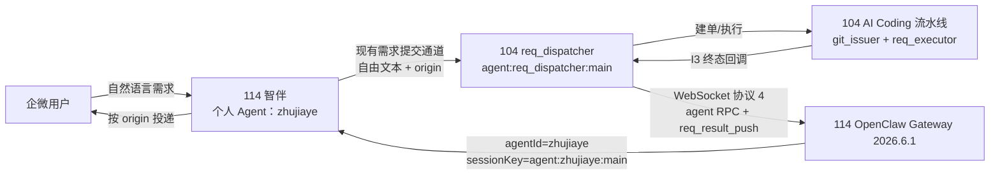
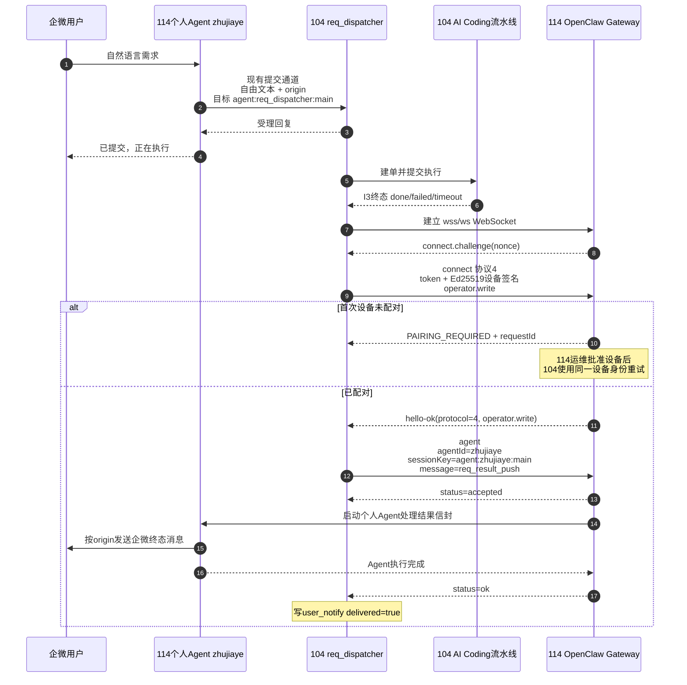

# 104 AI Coding 与 114 智伴通信对接协议

> 文档版本：2026-07-16.1
>
> 适用版本：104 OpenClaw `2026.4.9`，114 OpenClaw `2026.6.1`
>
> 部署区域：两端均位于公司蓝区
>
> 当前状态：104→114 协议 4 适配器已实现；114→104 继续复用现有需求提交通道

## 1. 对接结论

双方不升级 OpenClaw，通过通信端适配对方版本：

| 方向 | 发送端 | 接收端 | 当前方法 | 协议边界 |
|---|---|---|---|---|
| 需求提交 | 114 智伴 | 104 `req_dispatcher` | 复用当前已经可用的 AI Coding 需求提交通道，发送自由文本和 origin | 104 侧业务入口固定为 `agent:req_dispatcher:main`；本仓库不定义该外部通道的网络封装 |
| 受理回复 | 104 `req_dispatcher` | 114 智伴 | 沿现有需求提交调用返回 | 属于正向调用的应答，不等于任务终态通知 |
| 终态回推 | 104 `req_dispatcher` | 114 个人 Agent | 104 独立适配器直连 114 Gateway | WebSocket，Gateway 协议 4，设备签名 v3，`operator.write` |
| 企微投递 | 114 个人 Agent | 原企微会话 | 114 根据回推信封中的 origin 完成最后一跳 | 由 114 智伴实现，不由 104 直接调用企微 |

重要边界：

- 104 本机 OpenClaw 仍使用 `2026.4.9` 和协议 3。
- 104→114 只在独立适配器中使用协议 4，不加载或替换 104 的 OpenClaw 包。
- 114 的个人 Agent 名就是人员姓名，例如 `zhujiaye`；回推必须同时使用 `agentId=zhujiaye` 和 `sessionKey=agent:zhujiaye:main`。
- 当前闭环定义“受理回复 + 终态通知”。尚未定义执行百分比、步骤变化等中途进度事件。
- 如果 114 将来改为直接连接 104 Gateway，不能直接使用 `2026.6.1` 原生协议 4 客户端；必须另做协议 3 适配。当前已经工作的需求提交通道不需要因此改造。

## 2. 总体架构示意图



独立 Mermaid 源文件见 [`openclaw-104-114-sequence.mmd`](openclaw-104-114-sequence.mmd)。

## 3. 114→104：需求提交契约

### 3.1 接收目标

| 项目 | 固定值 |
|---|---|
| 104 Agent | `req_dispatcher` |
| 104 Session | `agent:req_dispatcher:main` |
| 消息主体 | 自由文本需求 |
| origin 首选来源 | OpenClaw 运行时结构化来源元数据 |
| origin 兼容来源 | 正文首个 `[origin]` 行 |

### 3.2 推荐业务消息格式

如果现有提交通道能够携带结构化来源元数据，优先传以下 JSON：

```json
{
  "channel": "wecom",
  "user": "wm_user_123",
  "conversation": "conv_456",
  "reply_agent": "zhujiaye",
  "source_agent": "zhujiaye",
  "source_session": "agent:zhujiaye:main"
}
```

如果通道不能传结构化来源元数据，在自由文本最前面增加一行：

```text
[origin] {"channel":"wecom","user":"wm_user_123","conversation":"conv_456","reply_agent":"zhujiaye","source_agent":"zhujiaye","source_session":"agent:zhujiaye:main"}
执行 test/login 项目的 #3 Issue
```

104 对 origin 的读取优先级为：

1. 运行时结构化 origin JSON。
2. 运行时离散来源字段。
3. 正文 `[origin]` 行。
4. 都没有时记为 `null`。任务仍可执行，但不会向 114 回推终态结果。

### 3.3 origin 字段

| 字段 | 必需性 | 含义 |
|---|---|---|
| `channel` | 回推必需 | 当前固定建议为 `wecom` |
| `user` | 回推必需 | 企微发起人标识 |
| `conversation` | 回推必需 | 原会话或群聊标识 |
| `reply_agent` | 强烈建议 | 114 上负责接收结果的个人 Agent 名，例如 `zhujiaye` |
| `source_agent` | 建议 | 发出需求的 114 个人 Agent 名 |
| `source_session` | 建议 | 发出需求的 Session，例如 `agent:zhujiaye:main` |

`reply_agent` 是回程路由的关键字段。104 优先使用它；只有它为空时才使用 104 部署配置中的 `DEFAULT_REPLY_AGENT`。origin 不是 JSON 对象时，104 不会使用默认 Agent 兜底回推。

### 3.4 正向 transport 的版本说明

当前仓库只约束 104 收到的目标 Session、自由文本和 origin，不包含 114 当前“AI Coding 平台需求提交”通道的网络实现。双方联调时，114 开发者需要确认现有通道属于以下哪一种：

- 已有中继或平台接口：保持不变，只补齐 origin。
- 直接连接 104 Gateway：必须确认客户端实际发协议 3；`2026.6.1` 的原生协议 4 客户端不能直接连接 `2026.4.9` Gateway。

## 4. 104→114：终态结果回推契约

### 4.1 连接参数

104 使用独立 Node.js 适配器连接 114 Gateway：

| 参数 | 值 |
|---|---|
| 传输 | `wss://`，或蓝区明确放行后的私网 `ws://` |
| Gateway 协议 | `minProtocol=4`，`maxProtocol=4` |
| Client ID | `cli` |
| Client mode | `cli` |
| Client displayName | `req-dispatcher-reply-adapter` |
| Client version | `2026.6.1` |
| Role | `operator` |
| Scopes | 仅 `operator.write` |
| 认证 | Gateway token + Ed25519 设备签名 |

这里的 `client.version=2026.6.1` 表示适配器采用 114 的线协议轮廓，不表示 104 的 OpenClaw 服务已升级。

### 4.2 WebSocket 握手帧

114 Gateway 建立 WebSocket 后先发挑战：

```json
{
  "type": "event",
  "event": "connect.challenge",
  "payload": {
    "nonce": "<114生成的一次性随机串>",
    "ts": 1784160000000
  }
}
```

104 返回 `connect` 请求：

```json
{
  "type": "req",
  "id": "<connect-request-uuid>",
  "method": "connect",
  "params": {
    "minProtocol": 4,
    "maxProtocol": 4,
    "client": {
      "id": "cli",
      "displayName": "req-dispatcher-reply-adapter",
      "version": "2026.6.1",
      "platform": "linux",
      "mode": "cli",
      "instanceId": "<instance-uuid>"
    },
    "caps": [],
    "auth": {
      "token": "<gateway-token>"
    },
    "role": "operator",
    "scopes": ["operator.write"],
    "device": {
      "id": "<sha256-hex-of-raw-public-key>",
      "publicKey": "<32字节Ed25519公钥的base64url>",
      "signature": "<Ed25519签名的base64url>",
      "signedAt": 1784160000000,
      "nonce": "<原样回显challenge nonce>"
    }
  }
}
```

设备签名原文必须严格按下面的单行拼接，字段之间使用 `|`：

```text
v3|<deviceId>|cli|cli|operator|operator.write|<signedAtMs>|<token>|<nonce>|<platform>|<deviceFamily>
```

当前适配器的 `deviceFamily` 为空，因此签名原文最后一个字符是 `|`。`platform` 和 `deviceFamily` 在签名前转为小写并去除首尾空白。

114 成功响应必须包含协议 4 和已授予的 `operator.write`：

```json
{
  "type": "res",
  "id": "<connect-request-uuid>",
  "ok": true,
  "payload": {
    "type": "hello-ok",
    "protocol": 4,
    "auth": {
      "role": "operator",
      "scopes": ["operator.write"]
    }
  }
}
```

`hello-ok` 实际还可以包含 `server`、`features`、`snapshot` 和 `policy`；104 只硬校验上述关键字段。

### 4.3 Agent 请求帧

握手成功后，104 向目标个人 Agent 发 `agent` 请求：

```json
{
  "type": "req",
  "id": "<agent-request-uuid>",
  "method": "agent",
  "params": {
    "message": "<下面定义的req_result_push JSON字符串>",
    "agentId": "zhujiaye",
    "sessionKey": "agent:zhujiaye:main",
    "timeout": 30,
    "idempotencyKey": "req-notify-v1-<64位sha256>"
  }
}
```

约束：

- `agentId` 必须与 `origin.reply_agent` 一致。
- `sessionKey` 必须属于同一 Agent，当前固定使用其 `main` Session。
- `message` 是 JSON 对象序列化后的字符串，不是嵌套 JSON 对象。
- `idempotencyKey` 对同一持久事件保持不变，供 114 Gateway 在缓存窗口内合并短期重试。
- 幂等缓存不是永久存储；长时间停机超过缓存窗口后仍可能重新执行。

### 4.4 业务信封 `req_result_push`

成功示例：

```json
{
  "kind": "req_result_push",
  "event": "result",
  "status": "done",
  "iid": 3,
  "content": "#3 已处理完成，MR：https://gitlab.example/group/project/-/merge_requests/8",
  "origin": {
    "channel": "wecom",
    "user": "wm_user_123",
    "conversation": "conv_456",
    "reply_agent": "zhujiaye",
    "source_agent": "zhujiaye",
    "source_session": "agent:zhujiaye:main"
  },
  "mr_url": "https://gitlab.example/group/project/-/merge_requests/8",
  "reason": null,
  "ts": "2026-07-16T10:20:30Z"
}
```

字段定义：

| 字段 | 类型 | 说明 |
|---|---|---|
| `kind` | string | 固定为 `req_result_push` |
| `event` | string | `result` 或 `failure` |
| `status` | string/null | `result` 通常为 `done`、`failed`、`timeout`；流程失败可为 `null` |
| `iid` | number/string/null | GitLab Issue IID；没有 Issue 时为 `null` |
| `content` | string | 114 可直接投递给用户的人读文案 |
| `origin` | object | 原始企微来源和回程 Agent 信息 |
| `mr_url` | string/null | 成功时的 MR 地址 |
| `reason` | string/null | 失败原因摘要 |
| `ts` | string | UTC ISO 8601 时间 |

文案映射：

| 场景 | `event` | `status` | `content` 形态 |
|---|---|---|---|
| 执行成功 | `result` | `done` | `#N 已处理完成，MR：<url>` |
| 执行失败 | `result` | `failed` | `#N 处理未通过：<reason>` |
| 执行超时 | `result` | `timeout` | `#N 处理超时未完成，已停放待人工处理` |
| 建单、路由或启动失败 | `failure` | 可为 `null` | `#N/任务 流程未能完成：<reason>` |

### 4.5 Agent 请求响应

114 Gateway 通常先返回受理状态：

```json
{
  "type": "res",
  "id": "<agent-request-uuid>",
  "ok": true,
  "payload": {
    "runId": "<114-run-id>",
    "status": "accepted",
    "acceptedAt": 1784160000000
  }
}
```

`accepted` 不是投递成功。104 会继续等待同一个请求 ID 的终态响应：

```json
{
  "type": "res",
  "id": "<agent-request-uuid>",
  "ok": true,
  "payload": {
    "runId": "<114-run-id>",
    "status": "ok",
    "summary": "delivered",
    "result": {
      "payloads": [
        {"text": "已发送给企微用户"}
      ]
    }
  }
}
```

只有 `frame.ok=true` 且 `payload.status=ok` 才视为成功。以下情况都视为失败并在 104 留痕：

- 只收到 `accepted`，一直没有终态。
- `frame.ok=false`。
- 终态为 `timeout`、`error` 或其他非 `ok` 值。
- WebSocket 提前断开。
- 114 未授予 `operator.write`。

这些 WebSocket 响应由 114 OpenClaw Gateway 生成。114 个人 Agent 的职责是消费业务信封并完成企微投递，不需要自行拼 Gateway 响应帧。

## 5. 完整时序图



## 6. 114 个人 Agent 的处理要求

114 每个人的 Agent 都应实现相同的结果接收逻辑：

1. 接收主 Session 中的消息。
2. 将消息解析为 JSON。
3. 严格检查 `kind == "req_result_push"`。
4. 检查 `origin.channel == "wecom"`，并校验 `origin.user`、`origin.conversation` 非空。
5. 可检查 `origin.reply_agent` 与当前 Agent 名一致，不一致时拒绝或告警，不能转发给其他用户。
6. 使用 `content` 作为企微正文；如需卡片展示，可使用 `status`、`iid`、`mr_url`、`reason` 组装。
7. 企微接口成功后再结束 Agent turn，使 Gateway 返回最终 `status=ok`。
8. 企微接口失败时让 Agent turn 失败或返回可识别错误，不能提前返回成功。

建议 114 侧记录以下审计字段，但不得记录 Gateway token：

- 当前 Agent 名。
- `origin.user` 和 `origin.conversation` 的脱敏值。
- `event`、`status`、`iid`、`ts`。
- Gateway `runId` 或智伴内部投递 ID。
- 企微投递结果。

## 7. 配对、配置与安全要求

### 7.1 首次设备配对

104 复用自己的持久设备身份：

```text
<OPENCLAW_STATE_DIR>/identity/device.json
```

该文件必须是当前运行用户所有的普通文件，并且组和其他用户没有读取权限。首次连接 114 通常返回 `PAIRING_REQUIRED`。在 114 执行：

```bash
openclaw devices list
openclaw devices approve <requestId>
```

批准时核对：

- 角色为 `operator`。
- scope 只有 `operator.write`。
- 设备 ID 与 104 日志中的配对请求一致。
- 后续重试继续使用同一 `OPENCLAW_STATE_DIR`，不要每次生成新设备。

### 7.2 104 配置

```bash
REPLY_GATEWAY_URL=wss://10.64.5.114:<gateway-port>
REPLY_GATEWAY_TOKEN=<通过安全方式注入>
REPLY_NOTIFY_TIMEOUT_SECONDS=30
REPLY_NOTIFY_WATCHDOG_GRACE_SECONDS=35
```

优先使用 `wss://`。如果蓝区确认只能使用明文私网 WebSocket，需在 104 的忽略配置或进程环境中显式加入：

```bash
OPENCLAW_ALLOW_INSECURE_PRIVATE_WS=1
```

安全约束：

- URL 不允许用户名、密码、query 或 fragment。
- token 只能通过环境变量进入适配器，不能拼在 URL、正文、命令参数或日志中。
- 公网地址不允许使用明文 `ws://`。
- `REPLY_NOTIFY_WATCHDOG_GRACE_SECONDS` 不得小于 `31`。

## 8. 常见错误与双方排查点

| 现象/错误 | 104 排查 | 114 排查 |
|---|---|---|
| `PAIRING_REQUIRED` | 确认使用稳定的设备身份 | `devices list` 后批准正确 requestId |
| `PROTOCOL_MISMATCH expectedProtocol=4` | 确认回推强制 `OPENCLAW_GATEWAY_PROTOCOL=4` | 确认接入的是 `2026.6.1` Gateway 端口 |
| 未授予 `operator.write` | 不应扩大申请 scope | 检查设备授权 scope |
| 找不到个人 Agent | 检查 `origin.reply_agent` | Agent 名必须与姓名完全一致，例如 `zhujiaye` |
| Session 路由错误 | 应为 `agent:<姓名>:main` | 确认个人 Agent 的主 Session 存在 |
| 只有 `accepted` 无终态 | 104 最终会超时并记失败 | 检查个人 Agent 是否卡住、企微调用是否一直未返回 |
| Gateway 已成功但企微没消息 | 检查业务信封中的 origin | 检查个人 Agent 是否真正执行了企微最后一跳 |
| 短时间重复消息 | 检查同一事件是否使用稳定 idempotencyKey | 检查 Gateway 幂等缓存和个人 Agent 重复处理 |
| 长时间恢复后重复消息 | 属于 Gateway 缓存窗口限制 | 如要求更强语义，114 需增加持久业务去重 |

104 默认审计位置：

```text
/data/req_dispatcher/_dispatcher/log/user_notify.jsonl
/data/req_dispatcher/_dispatcher/ledger.jsonl
```

其中：

- `user_notify` 且 `delivered=true`：104 已收到 114 Gateway 最终 `status=ok`。
- `user_notify_failed`：握手、Agent 执行、超时或网络失败。
- `user_notify_skipped`：缺少 origin、Gateway 配置或目标 Agent，因此没有出站。

`delivered=true` 说明 114 Agent turn 成功结束；114 仍应保留企微接口侧审计，以确认最后一跳确实成功。

## 9. 联调验收清单

按顺序执行：

- [ ] 114 提交一条带完整 origin 的测试需求，目标为 `agent:req_dispatcher:main`。
- [ ] 104 能解析出 `reply_agent=zhujiaye`，并返回受理信息。
- [ ] 首次 104→114 连接产生配对请求，114 只批准 `operator.write`。
- [ ] 重试后 114 Gateway 返回 `hello-ok` 且 `protocol=4`。
- [ ] 114 收到的 `agentId`、`sessionKey` 都指向 `zhujiaye`。
- [ ] 114 个人 Agent 收到的 message 可解析为 `req_result_push`。
- [ ] 成功场景能投递带 MR URL 的企微消息。
- [ ] 失败场景能投递 reason。
- [ ] 超时场景能投递“已停放待人工处理”。
- [ ] 同一事件立即重试不会重复启动个人 Agent。
- [ ] Agent 故意只保持 `accepted` 不结束时，104 能超时并写 `user_notify_failed`。
- [ ] 错误 `reply_agent` 不会被静默投递给其他人的 Agent。
- [ ] 104 和 114 的日志都不出现 Gateway token 或完整设备私钥。

## 10. 当前未包含的能力

以下内容不属于当前已经实现的契约，若需要应另行版本化设计：

- 任务执行中的百分比或阶段进度推送。
- 超过 Gateway 幂等缓存窗口后的永久精确一次投递。
- 114→104 现有需求提交通道的网络协议替换。
- 多个个人 Agent 共用一个回程 Session。
- 104 直接调用企微接口。

建议后续新增任何业务字段时，引入显式信封版本，例如 `schema_version: 2`，并保持 114 对未知字段宽容、对未知 `kind` 拒绝。

## 11. 实现依据

- 104 协议 4 适配器：`workspace-req_dispatcher/skills/requirement_dispatch/scripts/openclaw_agent_gateway_v4.mjs`
- 协议分流：`workspace-req_dispatcher/skills/requirement_dispatch/scripts/openclaw_agent_transport.sh`
- 终态业务信封：`workspace-req_dispatcher/skills/requirement_dispatch/scripts/notify_user.sh`
- origin 捕获：`workspace-req_dispatcher/skills/requirement_dispatch/scripts/capture_origin.sh`
- 帧级集成测试：`workspace-req_dispatcher/skills/requirement_dispatch/tests/test_openclaw_agent_gateway_v4.mjs`
