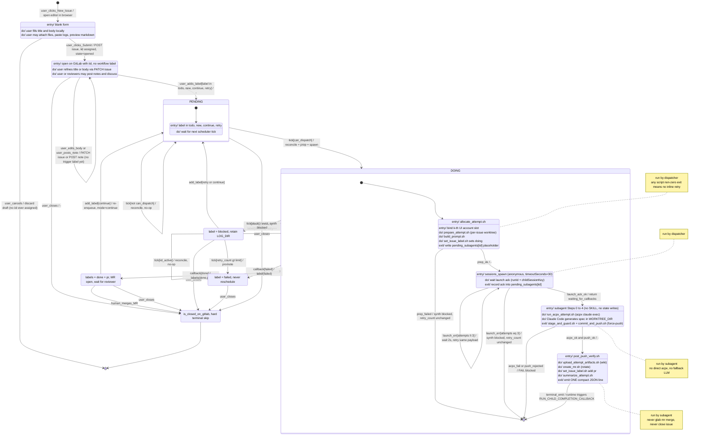

> ⚠️ 已废弃 / 历史 v1。本文件描述早期语义（单一 `blocked`/`failed`、`done`+`pr` 共存、`continue` 重入队），已被取代。当前 benchmark-test 分支的权威状态机见 `workspace-acpx_auto_tester/skills/gitlab_issue_campaign_dispatcher/references/label_lifecycle.md`（及 statemachine.v2.md §6）。请勿据本文件理解当前行为。

# Issue 全生命周期状态机

本文件是历史 v1 快照，描述早期标签生命周期与 dispatcher 算法（保留作历史记录，不反映当前 benchmark-test 行为）。

- **状态边界 = GitLab 上 issue 的可观察状态**（标签组合 + open/closed）。
- **状态内部的 entry/do/exit** = dispatcher 或 subagent 在该状态下执行的脚本/动作（note 标注执行者）。
- **转移边 `event[guard]/activity`** = 外部事件（人触发 / scheduler tick / runtime callback）+ 判定条件 + 转移时附带的副作用。
- **self-loop** 表达"事件来了但 guard 不满足只能空转"或"重试相同动作"。

## 图示

## 图里 guard / activity 的缩写

- `tick` = `scheduler_tick`，每次都先跑 `reconcile.sh` 并写 `reconcile-<ts>.json` 证据文件。
- `can_dispatch` = `reconcile_ok` ∧ `pending_subagents` 空 ∧ `batch_slot_free` ∧ `launch_quota_ok` ∧ `not iid_active`。
- `stuck` = `pending_subagents[iid]` 等待超过 `stuck_after_minutes`（默认 330 分钟）。
- `callback[*]` 三条共享的副作用：drain `pending_subagents[iid]` + 尽力 `subagents kill` 子会话；图里只写了状态特有的标签转移。
- DOING→DONE 时 GitLab 仍 open；要等人合并对应 MR 后，GitLab 通过 MR 描述里的 `Closes #<iid>` 自动把 issue 改为 closed。

## 唯一一条画不进图的约定

**GitLab 实时标签 = 状态的 source of truth；磁盘 `campaign_state.json` / `state.json` / `attempt_state.json` 只是 dispatcher 的进度缓存。**

它决定了图里所有 guard（`iid_active`、`retry_count > blocked_retry_limit`、`stuck` 等）该读哪份数据：缓存与 GitLab 冲突时永远以 GitLab 为准，靠每个 tick 强制跑 `reconcile.sh` 并写 `reconcile-<ts>.json` 证据文件兜底。**没有证据文件 = 这个 tick 直接判失败**。
