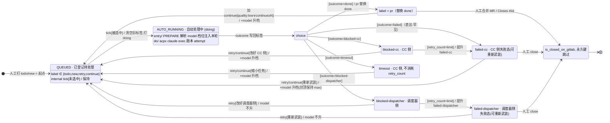
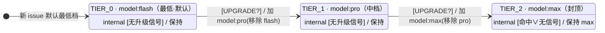

# Issue 状态机 v2 —— 状态与 issue label 模型

> 对应文件：[`statemachine.v2.drawio`](statemachine.v2.drawio)（四页：① Issue 主状态机 / ② 调度器+执行 / ③ 耦合参考 / ④ model 自动升级状态机）。
> 本文件聚焦**状态清单**与**issue label 模型**，并标注本轮相对上一版的改动。v1 仍保留在 [`statemachine.drawio`](statemachine.drawio) / [`statemachine.md`](statemachine.md) 以便对照。

---

## 0. 本轮状态 / label 改动摘要（相对上一版）

| 改动 | 说明 | 语义影响 |
| --- | --- | --- |
| **`failed` 按归因拆成 `failed-cc` / `failed-dispatcher`** | 镜像 `blocked` 的拆法：`blocked-cc` 超限 → `failed-cc`，`blocked-dispatcher` 超限 → `failed-dispatcher` | 失败终态也"看到即知改哪边" |
| **新增 `model:{tier}` 正交持久维度** | 第 4 页「model 自动升级状态机」：按解决质量自动逐级升 model（`model:flash → model:pro → model:max`） | 新增一条与工作标签**正交**的 label 维度 |
| **新增 `quality:low` 软信号 label** | 人工在评审态加，作为升 model 档的软触发之一；升档生效后移除（一次性） | 新增一个一次性人工提示 label |
| **model 升档触发按侧统一** | CC 侧 `{blocked-cc, timeout, failed-cc}` 重跑 → 升一档；调度器侧 `{blocked-dispatcher, failed-dispatcher}` → 不升 | 升 model 只在"模型能力不够"时发生 |
| UML 记法规范化 | `entry/do/exit` 补齐、`choice` 伪状态、转移标签 `trigger [guard] / effect`、自环改 internal transition、说明框改 note 形、"失败终态"正名为可重新武装的失败态、人工动作线型统一紫色虚线 | 仅图记法，不改 label/状态语义 |
| （上一版已有）`pr` **替换** `done` | `pr` 不再叠加在 `done` 上，而是替换它 | 工作标签收敛成单一互斥维度 |
| （上一版已有）`blocked` 拆 `blocked-cc` / `blocked-dispatcher` | 按 CC 侧 / 调度器侧归因拆 | 阻塞态"看到即知改哪边" |

> **落地状态**：上表中除"UML 记法"外，整套 enriched label 模型（`blocked` 拆分、`failed` 拆分、`pr` 替换 `done`、`model:{tier}`、`quality:low`）目前是**状态机设计提案**，图已就绪、代码尚未落地。配套改动见 [§7](#7-落地影响代码改动清单)。

---

## 1. 状态清单（主状态机 · 第 1 页）

每个状态对应一个 GitLab 工作标签（终态 `CLOSED` 对应 issue 的 `closed`）。按 UML 补齐 `entry/ do/ exit/`。

| 状态 | label | entry/ | do/ | exit/ | 人是否介入 |
| --- | --- | --- | --- | --- | --- |
| **QUEUED** 已登记待处理 | `todo` / `new` / `retry` / `continue` | 人工打入口标签 = 状态机起点 | 等待被调度器自动认领 | `tick [被选中]` → `AUTO_RUNNING`；`internal: tick [未选中] / —`（保持） | 打标签（起点） |
| **AUTO_RUNNING** 自动处理中 | `doing` | 清空旧工作标签、打 `doing`；PREPARE 解析 `model` 档位并注入本轮 | `acpx claude exec` 跑本 attempt | 完成 → `outcome` 写回标签（→ `choice` 按 `outcome` 分流） | 无（观察） |
| **AWAITING_REVIEW** 待人工评审 | `pr` | agent 完成并开 MR → 加 `pr`（`pr` 替换 `done`） | 人工 review 这个 MR | 合并 MR → `CLOSED`；或加 `continue`（可带 `quality:low`）→ `QUEUED` | review / 合并 |
| **blocked-cc** CC 侧阻塞 | `blocked-cc` | `outcome=blocked-cc` 写回：acpx 非超时失败 / `NO_CHANGES` / push 被拒 / acpx 后步骤失败 | partial work 已 push 到 `WORK_BRANCH`；待人工处理 | 改提示词 + hulat → `retry`/`continue` → `QUEUED`（升 model 档）；或 `[retry_count > limit]` → `failed-cc` | 改 issue 提示词 / hulat |
| **blocked-dispatcher** 调度器侧阻塞 | `blocked-dispatcher` | `outcome=blocked-dispatcher` 写回：prep / spawn / scope eviction / 子流程错 / 等不到回调(stuck) | 无 CC 产出，`block_reason` 记录原因 | 改 dispatcher → `retry` → `QUEUED`（model **不升**）；或 `[retry_count > limit]` → `failed-dispatcher` | 改 dispatcher agent |
| **timeout** 超时（CC 侧） | `timeout` | `outcome=timeout` 写回：`acpx` 跑超 wall-clock 上限 | partial 已 push，无 MR/pr；不自动重试、不消耗 `retry_count`（parked） | 改提示词/hulat 缩小任务 → `retry`/`continue` → `QUEUED`（升 model 档）；**不提升 failed** | 改 issue 提示词 / hulat |
| **failed-cc** CC 侧失败态（可重新武装） | `failed-cc` | `blocked-cc` 的 `retry_count > limit` 被提升（retry budget 耗尽是唯一成因）；或 `outcome=failed` 直达 | 永不自动重排；待人工处理（CC 侧） | 改提示词/hulat → `retry`/`continue` 重新武装 → `QUEUED`（升 model 档）；或人工 `close` → `CLOSED` | 改提示词/hulat 或关闭 |
| **failed-dispatcher** 调度器侧失败态（可重新武装） | `failed-dispatcher` | `blocked-dispatcher` 的 `retry_count > limit` 被提升 | 永不自动重排；待人工处理（调度器侧） | 改 dispatcher → `retry` 重新武装 → `QUEUED`（model **不升**）；或人工 `close` → `CLOSED` | 改 dispatcher 或关闭 |
| **CLOSED** 终态 | issue `closed` | MR 合并 → `Closes #iid` 自动关闭；或人工直接关闭 | `reconcile` 永久硬跳过，不再调度 | 完成转移 → `●(final)`（业务终态，无出口转移） | 无 |

> `failed-cc` / `failed-dispatcher` 不是 UML 终态（它们有出边可被人工重新武装）；真正的 final 只有主状态机末尾的 `●`。任意非终态都可被人工 `close` → `CLOSED`（图中仅画 `failed-cc → CLOSED` 一条示例）。

---

## 2. issue label 模型

issue 的 label 分成**两条正交维度**：①工作标签（互斥单一维度）；②`model` 档位（正交持久维度）。外加一个一次性软信号 label `quality:low`。

### 2.1 工作标签维度（互斥，任意时刻恰好一个）

| 分组 | label | 含义 |
| --- | --- | --- |
| 入口 | `todo` / `new` / `retry` / `continue` | 人工打的状态机起点 / 重新武装 |
| 进行 | `doing` | 已被自动认领，agent 处理中 |
| 产出（临时） | `done` | 写完 Wiki、建 MR 前的过渡态 |
| 待评审 | `pr` | 建 MR 后**替换** `done`（`done` 被移除） |
| 异常 | `blocked-cc` / `blocked-dispatcher` / `timeout` / `failed-cc` / `failed-dispatcher` | 按归因拆分的失败/阻塞/超时态 |

- **互斥**由 `set_issue_label.sh` 保证：加任一工作标签都会移除其它工作标签。`{done+pr}` 不再并存（`pr` 替换 `done`）；唯一瞬态并存对是建 MR 前失败的 `{done + blocked-cc}` 或 `{done + blocked-dispatcher}`。
- **进 `doing` 的清除集**（`set_issue_label.sh add doing` 时移除，只留 `doing`）：
  `{ todo, new, retry, continue, done, pr, blocked-cc, blocked-dispatcher, timeout, failed-cc, failed-dispatcher }`。
  **注意：该清除集不含 `model:{tier}`**——model 维度是持久的，进 `doing` 不清除。

### 2.2 model 档位维度（正交、持久、单调升 · 第 4 页）

| label | 档位 | 含义 |
| --- | --- | --- |
| `model:flash` | TIER_0（最低 · 默认） | 新 issue 首次 PREPARE 显式打的最低档；用最便宜模型先试 |
| `model:pro` | TIER_1（中档） | 命中升档信号后由 flash 升入 |
| `model:max` | TIER_2（封顶 · 最强） | trigger 可配有序 model 列表的最后一档（图中 3 档为示例） |

- 与工作标签**正交并存**；互斥只在 model 维度内部（任意时刻恰好一个 `model:{tier}`）。
- **单调不降**：只会被换成更高档，跟随 issue 终身到 `CLOSED`。新 issue 无 `model:{tier}` → 视为 TIER_0，首次 PREPARE 显式打最低档。
- source of truth = GitLab 标签；`state.json` 的 `model_tier` 只是缓存，`reconcile` 让缓存向标签看齐。

### 2.3 软信号 label：`quality:low`

- 人工在评审态（`AWAITING_REVIEW`）加，表示"这轮结果质量一般"。
- 作为升 model 档的**软触发**之一；**升档生效后被移除**（一次性提示，不长期存在）。

---

## 3. model 升档触发（UPGRADE?）

下一次 attempt 是否升 model 档，在调度器 **PREPARE 阶段的 `RESOLVE MODEL TIER`** 求值（即"重新武装并进 `doing`"时），写新的 `model:{tier}` 标签：

```
UPGRADE? = 硬触发 ∪ 软触发
  硬触发：上一轮 outcome ∈ { blocked-cc, timeout, failed-cc }
  软触发（任一）：quality:low ∨ continue 累计次数 ≥ N ∨ 自动评分 < 阈值（黑盒·未实现·占位）
  排除：blocked-dispatcher / failed-dispatcher（调度器/基础设施侧，升 model 无用）
判定：命中且未封顶 → 升一档；命中但已封顶 → 保持 max；未命中 → 保持当前档。
```

> 一句话规则：**CC 侧 `{blocked-cc, timeout, failed-cc}` 重跑 → 升一档；调度器侧 `{blocked-dispatcher, failed-dispatcher}` → 不升。**

---

## 4. 状态转移 + 触发 label（outcome → label 映射）

主状态机的迁移由 GitLab 标签事件驱动。两台状态机唯一接口 = GitLab 实时标签：

- **A→B（人 → 调度器）**：标签事件 `todo`/`new`/`retry`/`continue`/`close` 是 tick 输入，tick 读到标签就启动子流程。
- **B→A（调度器 → 人）**：子流程产出的 `AttemptOutcome` 写回标签，推动主状态机迁移。`AUTO_RUNNING` 完成后经 `choice` 伪状态按 `outcome` 分流：

| outcome | 写回 label | 迁移到 |
| --- | --- | --- |
| `done` | `pr`（替换 `done`） | `AWAITING_REVIEW` |
| CC 侧失败 | `blocked-cc` | `blocked-cc` |
| 调度器侧失败 | `blocked-dispatcher` | `blocked-dispatcher` |
| acpx 超时 | `timeout` | `timeout` |
| `failed`（直达·罕见） | `failed-cc` | `failed-cc` |
| `blocked-cc` 且 `retry_count > limit` | `failed-cc` | `failed-cc`（自动提升） |
| `blocked-dispatcher` 且 `retry_count > limit` | `failed-dispatcher` | `failed-dispatcher`（自动提升） |

---

## 5. 主状态机（mermaid · 含 failed 拆分 + model 维度注解）



## 6. model 自动升级状态机（mermaid · 第 4 页）



> 档数 = trigger 可配的有序 model 列表（此处 3 档为示例）。升档「触发」分散在主状态机各失败/评审状态的重跑边上，`RESOLVE` 只在进 `doing` 时「应用」。

---

## 7. 落地影响（代码改动清单）

整套 enriched label 模型目前是**状态机设计提案**，图已就绪、脚本/代码尚未落地。要落地需要：

- `scripts/ensure_labels.sh`：创建 `blocked-cc` / `blocked-dispatcher` / `failed-cc` / `failed-dispatcher` / `timeout` / `pr` / `model:flash|pro|max` / `quality:low`，移除单一 `blocked` / `failed`。
- `scripts/set_issue_label.sh`：工作标签互斥组扩展（含两类 `failed`），并把 `model:{tier}` 排除出"进 `doing` 清除集"。
- `scripts/reconcile.sh`：`has_blocked` / `has_failed` 信号按侧拆成两路；新增读取 `model:{tier}` 当前档。
- `temporal/workflows/campaign.py`：`_classify` 与 outcome→label 同步按侧拆（`blocked-cc→failed-cc`、`blocked-dispatcher→failed-dispatcher`）；`pr` 替换 `done`；新增 PREPARE 阶段 `resolve_model_tier`（求 `UPGRADE?` 并写 `model:{tier}`、注入 build_prompt）。
- executor 失败路径：按归因 sync `blocked-cc` / `blocked-dispatcher` / `timeout`；成功路径 `done → pr`。

这些改动落在 `workspace-acpx_auto_tester/` 下，会触发 `SKILL_VERSION` 升版与 code-review 流程；本轮只更新状态机图与本说明文档，未改这些脚本/代码。

---

## 8. 唯一一条画不进图的约定

**GitLab 实时标签 = 状态唯一真相；磁盘 `campaign_state.json` / `state.json`（含 `model_tier`）/ `attempt_state.json` 只是 dispatcher 的进度缓存。** 缓存与 GitLab 冲突时永远以 GitLab 为准；每个 tick 强制跑 `reconcile.sh` 并写 `reconcile-<ts>.json` 证据文件兜底——**没有证据文件 = 这个 tick 判失败**。
