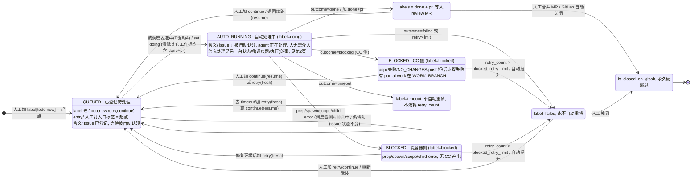

# Issue 状态机 v2

> 对应文件：[`statemachine.v2.drawio`](statemachine.v2.drawio)（三页）。本文件是 v2 的说明稿，逐条回应评审会意见，并附第 1 页主状态机的 mermaid 版本。v1 仍保留在 [`statemachine.drawio`](statemachine.drawio) / [`statemachine.md`](statemachine.md) 以便对照。

## v2 的核心改动：拆成两个互相驱动的状态机

| 状态机 | 范围 | 边界 = 什么 | 谁看 |
| --- | --- | --- | --- |
| **A：Issue 主状态机** | 第 1 页 | 人需要**看到 / 处理**的状态（GitLab 标签 + open/closed） | 评审人 / 用户 |
| **B：调度器 + 执行状态机** | 第 2 页 | `doing` 内部的自动步骤（Temporal CampaignWorkflow + IssueAttemptWorkflow） | 运维 / 开发 |
| 耦合 + 参考 | 第 3 页 | 两机如何互相驱动、label 模型、retry/continue 差异、blocked 归因 | 全员 |

两个状态机**唯一的接口是 GitLab 实时标签**（source of truth）：A 的标签事件是 B 的输入；B 的执行结果写回标签，推动 A 迁移。

## 逐条回应评审意见

### 1. 人的行为与 issue 状态如何融合（continue 还是 retry）

由「人打的标签」决定，dispatcher 用 `_attempt_mode_for_entry`（`temporal/workflows/campaign.py`）解释：

- 加 `continue`（且 `continue` 是**唯一**工作标签）→ **continue 模式**：在 `origin/WORK_BRANCH` 上续跑，恢复上轮 `ifp-result/issue-<iid>/` 产物，prompt 注入上轮 summary + 评审意见。
- 加 `retry` / `todo` / `new`（或 `continue` 与其它工作标签并存）→ **fresh 模式**：重置到 `origin/DEV_BRANCH` 干净基线，归档上轮产物。

经验法则：上轮方向对、只差细节、只在 issue 留补充说明 → `continue`；上轮跑偏、改了规格 / 共享配置、要从头来 → `retry`。注意 agent 永不自己打 `continue`，它永远是人工评审动作。

→ 体现在第 1 页右下角「人工行为 ⇄ 自动状态融合」框 + 第 3 页 ④。

### 2. 状态机起点改成特定标签

起点不再是浏览器里建 issue 的 `DRAFTING` / `SUBMITTED` 过程，而是**人工打入口标签 `todo` / `new`**：初始结点 → `QUEUED`（label ∈ {todo, new, retry, continue}）。

→ 第 1 页 `m_start → QUEUED` 边「人工加 label[todo|new] = 起点」。

### 3. label 是否要独立

拆成两个**正交维度**：

- **维度① 生命周期状态（互斥，任意时刻恰好一个）**：`todo` / `new` / `retry` / `continue` / `doing` / `done` / `blocked` / `timeout` / `failed`。
- **维度② PR 标志（独立附加，仅在 `done` 上有意义）**：`pr`。

互斥由 `set_issue_label.sh` 保证：加任一工作标签都会移除其它工作标签，仅允许两个并存对 `{done+pr}`、`{done+blocked}`（失败窗口瞬态）。**结论：`pr` 是独立标志，其余生命周期标签互斥。**

→ 第 3 页 ①。

### 4. 重跑之后 pr label 是否删掉

**删。** 进入 `doing` 的那一步（`set_issue_label.sh add doing`）会移除 `{todo, new, retry, continue, done, pr, blocked, timeout, failed}`，只留 `doing`。所以每次重跑一开始 `pr`（连同 `done`）就被清除；若本轮再次达成 `done`，`create_mr.sh` 会轮换出一个新 MR 并重新加回 `pr`。

→ 第 1 页 `QUEUED → AUTO_RUNNING` 边显式标注 + 第 3 页 ②。

### 5. retry 和 continue 的结果应该有差异

|  | retry / fresh | continue / resume |
| --- | --- | --- |
| worktree 基线 | `origin/DEV_BRANCH` | `origin/WORK_BRANCH` |
| 上轮产物 | 归档不带入 | 恢复 `ifp-result/issue-<iid>/` |
| prompt | 全新 | 注入上轮 summary + 评审意见 |
| 触发标签 | `retry` / `todo` / `new` | `continue`（且为唯一工作标签） |
| MR | 轮换出新 MR | 轮换出新 MR（`Supersedes` 旧） |
| 适用 | 上轮跑偏 / 改了规格 | 上轮方向对、续做 |

→ 第 3 页 ②，并在第 1 页人工动作边上区分 `(fresh)` / `(resume)`。

### 6. 调度器状态机与 issue 状态机区分，且可互相驱动

拆成 A、B 两页（见上）。互相驱动：

- **A→B**：标签事件（`todo`/`new`/`retry`/`continue`/`close`）是 tick 的输入，tick 读到标签就启动子流程。
- **B→A**：子流程产出的 `AttemptOutcome`（`done+pr` / `blocked` / `timeout` / `failed`）写回 GitLab 标签，推动 A 迁移。

**不混画**：第 1 页所有结点都是 issue 状态（GitLab 标签可观察），dispatcher 的状态全在第 2 页。v1 把 `PREPARING/SPAWNING/EXECUTING/PUBLISHING` 这套 dispatcher+子流程状态嵌套进 issue 的 `DOING` 里，是典型的混画；v2 已折叠成单个 `AUTO_RUNNING`，且 issue 状态框内不再出现「prep / 启动子流程 / worktree / acpx / force-push」等 dispatcher 机制描述——这些只留在第 2 页。两机只通过实时标签互相驱动。

→ 第 3 页耦合图（两条带箭头的驱动边 + 中间「唯一接口 = GitLab 实时标签」）。

### 7. blocked 区分调度器问题还是 CC 问题，用户据此处理

`blocked` 是同一个标签，但两类归因，靠 `block_reason` / summary 区分：

- **CC 侧（Claude Code 工作问题）**：acpx 非超时失败 / `NO_CHANGES` / push 被拒 / acpx 后步骤失败。有 partial work 在 `WORK_BRANCH`。人工：读 partial + summary → `continue` 带说明，或 `retry` 重做。
- **调度器侧（编排 / 基础设施问题）**：prep 失败 / spawn 3 次失败 / scope eviction / 子流程未产出即报错。无 CC 产出。人工：多为环境/runner 问题 → 修复后 `retry`（scope eviction 不消耗 `retry_count`）。

→ 第 1 页 `BLOCKED` 容器拆成「① CC 侧」「② 调度器侧」两格；第 2 页失败流标注【CC 侧】/【调度器侧】；第 3 页 ③。

### 8. 不需要人介入的状态不放进主状态机

`doing` 内部的全部自动步骤（prep / spawn / stage / commit / verify / wiki / mr / summarize、以及 dispatcher 记账）从主状态机移除，折叠成主状态机里的单个 `AUTO_RUNNING`，细节下沉到第 2 页。

### 9. 需要人看到或处理的放进主状态机

第 1 页只保留人需要看到 / 处理的状态：`QUEUED`（人打标签）、`AUTO_RUNNING`（人观察）、`AWAITING_REVIEW`（人 review/合并）、`BLOCKED`（人决策 continue/retry/修环境）、`TIMEOUT`（人决策）、`FAILED`（人重新武装或关闭）、`CLOSED`。

## 第 1 页主状态机（mermaid 版）

> 任意非终态都可被人工 `close` → `CLOSED`（图中为减少连线只画了 `FAILED → CLOSED` 一条示例）。

## 唯一一条画不进图的约定

**GitLab 实时标签 = 状态唯一真相；磁盘 `campaign_state.json` / `state.json` / `attempt_state.json` 只是 dispatcher 的进度缓存。** 缓存与 GitLab 冲突时永远以 GitLab 为准；每个 tick 强制跑 `reconcile.sh` 并写 `reconcile-<ts>.json` 证据文件兜底——**没有证据文件 = 这个 tick 判失败**。
